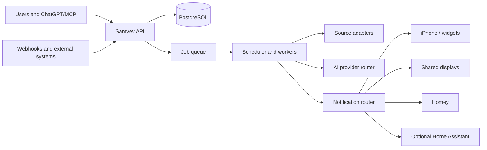

# Architecture

Status: **Proposed architecture for validation**

## 1. Design approach

Samvev separates durable orchestration from conversational AI. A chat or form may create a task, but the Samvev server owns scheduling, permissions, source state, delivery, audit history and failures.



## 2. Proposed components

### Web application

One responsive TypeScript web application can initially serve:

- first-run setup
- household administration
- task and notification management
- shared-display mode
- display pairing and configuration

The shared display must run as a restricted client, not an administrator session placed in kiosk mode.

### API service

A Python/FastAPI service is currently proposed for:

- authentication/session integration
- household and permission enforcement
- task and message APIs
- display pairing
- notification and action APIs
- MCP tool endpoints
- integration configuration

The language/framework choice remains a draft until the first implementation ADR is accepted.

### Scheduler and worker

Workers own:

- cron and interval schedules
- source fetching
- content hashing and change detection
- document extraction
- AI calls through a provider-neutral contract
- delivery fan-out and retries
- retention and expiry jobs

The scheduler must be restart-safe and must not rely on in-memory timers as the only source of truth.

### Database and object storage

PostgreSQL is proposed for structured state. Original source snapshots and attachments should use object storage or a filesystem abstraction suitable for local self-hosting and hosted deployments.

### Native iOS application

The iPhone client and WidgetKit extension consume versioned APIs. Widgets read a constrained snapshot and deep-link to details in the app. The client must never contain provider secrets.

### Integration adapters

Adapters translate external systems into common events and actions. Initial adapters:

- Homey
- generic webhook
- website/PDF source
- optional Home Assistant

Later adapters can add calendars, Spond, Google Keep import and other services.

## 3. Multi-household model

Even self-hosted installations should avoid assuming exactly one household. Core records should include an installation boundary and household identifier. A user may belong to more than one household later, for example in co-parenting arrangements.

Every API request must derive effective access from authenticated membership and explicit capabilities. Client-side filtering is not authorization.

## 4. Scope model

Content can be scoped as:

- personal
- selected people
- household
- selected display group
- service/admin only

A display receives a projection created for that display. It must not download private records and merely hide them in the interface.

## 5. Common event and notice model

Adapters produce normalized events. Rules and workers create notices from events.

```json
{
  "id": "evt_...",
  "household_id": "hh_...",
  "source": {
    "type": "web_document",
    "connection_id": "conn_...",
    "original_url": "https://example.invalid/source"
  },
  "occurred_at": "2026-09-06T06:30:00+02:00",
  "received_at": "2026-09-06T06:31:04+02:00",
  "kind": "source.changed",
  "payload_version": 1,
  "payload": {},
  "sensitivity": "household"
}
```

A notice adds audience, display window, importance, source evidence, actions and uncertainty.

## 6. AI boundary

AI providers receive only the minimum permitted source content and a strict output schema. The server validates output before persistence or delivery.

The AI provider must not decide:

- who is authorized
- whether a source actually changed
- when a schedule fires
- whether a physical action is permitted
- whether a delivery was completed

Provider routing considers sensitivity, cost, capability and household policy. Local AI should be supported without changing the task model.

## 7. Delivery model

The notification router creates one delivery record per channel and recipient/display. Channels are idempotent and retryable.

Typical states:

```text
queued -> sending -> delivered -> displayed -> acknowledged
                       |              |
                       +-> failed     +-> expired
```

A Homey Flow invocation, web-display update, app push and widget snapshot are separate deliveries of the same notice.

## 8. Real-time display updates

The first web display can use Server-Sent Events for simple server-to-display updates, with polling fallback. WebSocket may be introduced if bidirectional real-time interactions justify it.

The display caches only its authorized, current projection and should clearly indicate stale/offline data.

## 9. Authentication and first-run claim

The first-run flow must generate a claim state that expires or becomes unavailable after ownership is established. Production hosting must not expose a permanent unauthenticated “create first admin” endpoint.

Display pairing uses a short-lived code and creates a restricted credential that can be revoked independently.

## 10. Physical actions

Samvev should prefer invoking allowlisted Homey/Home Assistant routines rather than receiving broad device-control credentials. Sensitive actions can require:

- explicit user confirmation
- recent authentication
- role capability
- location or presence checks
- audit entry

## 11. Deployment profiles

### Local self-hosting

A Docker Compose profile should eventually provide web, API, worker and PostgreSQL with local storage and a guided web setup.

### Managed hosting

A hosted profile may use managed database/object storage and multi-tenant isolation, but must preserve the same product capabilities and export paths.

### Local bridge

A small outbound-connected bridge may later provide safe access to local Homey, Home Assistant, Ollama and LAN services without directly exposing them to the internet.

## 12. Proposed monorepo

```text
apps/web
apps/ios
services/api
services/worker
packages/contracts
packages/design-tokens
integrations/homey
integrations/home-assistant
integrations/web-source
integrations/webhook
infra/compose
docs
```

## 13. Open architectural decisions

- final backend and job-queue stack
- identity provider versus first-party authentication
- object storage abstraction
- local bridge protocol and update model
- iOS licensing before distribution
- exact Shelly Wall Display XL rendering path after hardware testing
- MCP deployment and authentication model
- encrypted backup and restore format
