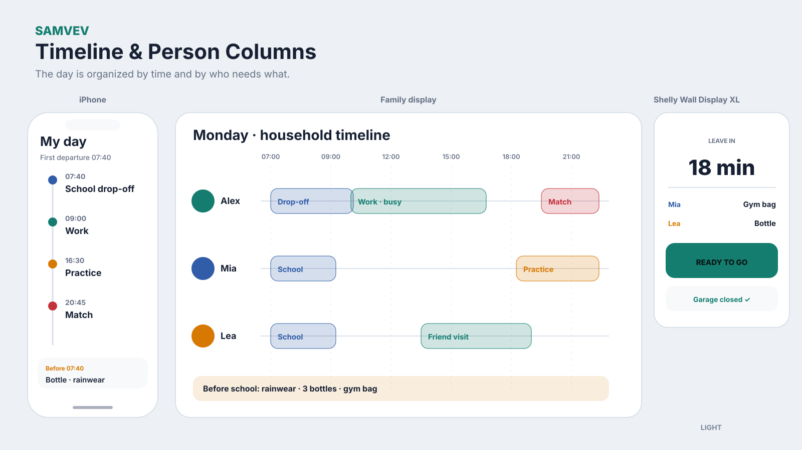
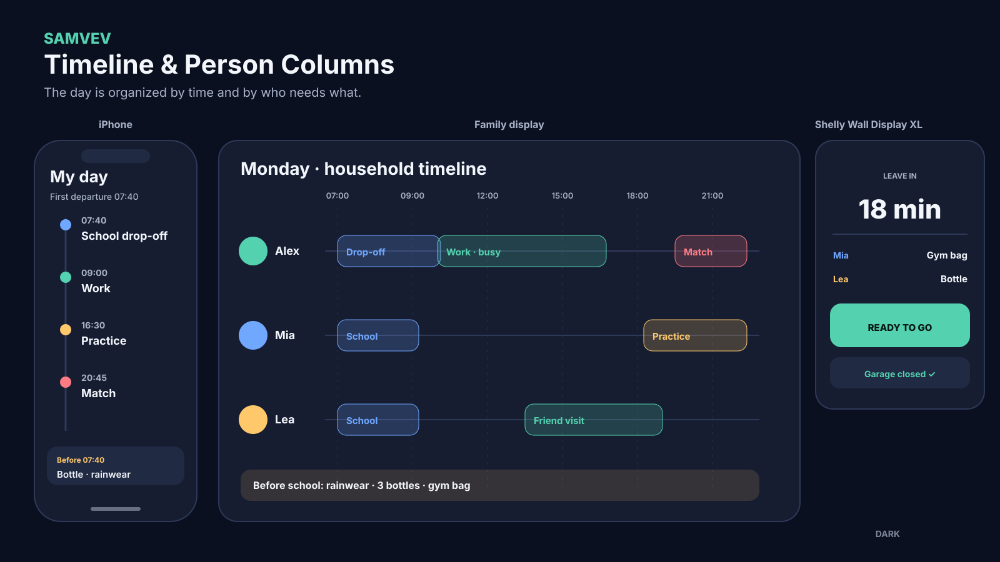

# Timeline and Person Columns

## Organizing idea

A shared day timeline plus a lane or column for each household member.

## Best suited for

School mornings, departures and understanding who needs what.

## Surface behavior

- **iPhone:** personal priority and actions first
- **Shared display:** household-safe group view readable at a distance
- **Shelly Wall Display XL:** one or a few location-relevant items with large controls

## Guardrail

Provide a dedicated lane for untimed notices and avoid narrow text-heavy columns.

## Light and dark mockups

The diagrams use fictional data and show layout logic rather than final visual polish.
