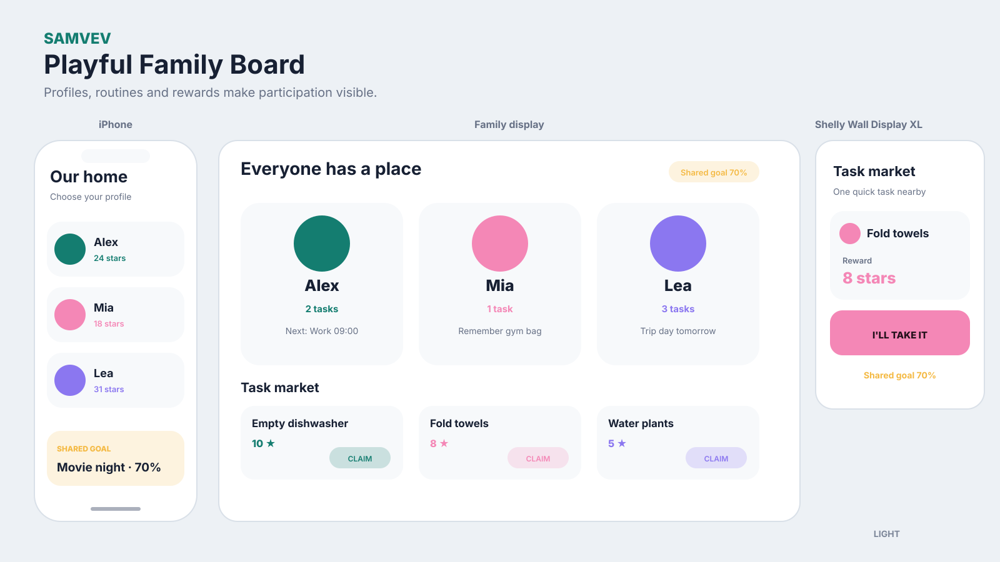
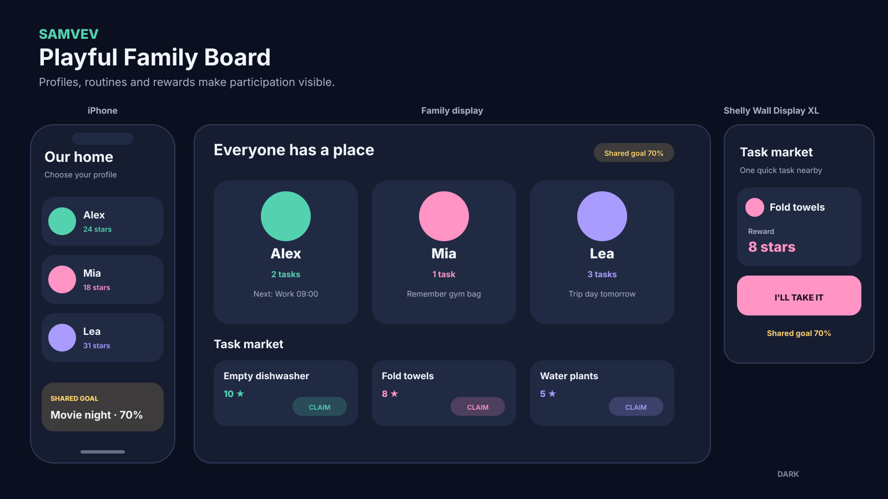

# Playful Family Board

## Organizing idea

Each person is a strong entry point into routines, tasks, messages and rewards.

## Best suited for

Participation by children and claimable household work.

## Surface behavior

- **iPhone:** personal priority and actions first
- **Shared display:** household-safe group view readable at a distance
- **Shelly Wall Display XL:** one or a few location-relevant items with large controls

## Guardrail

Offer a neutral maturity setting and avoid decorative reward pressure.

## Light and dark mockups

The diagrams use fictional data and show layout logic rather than final visual polish.
