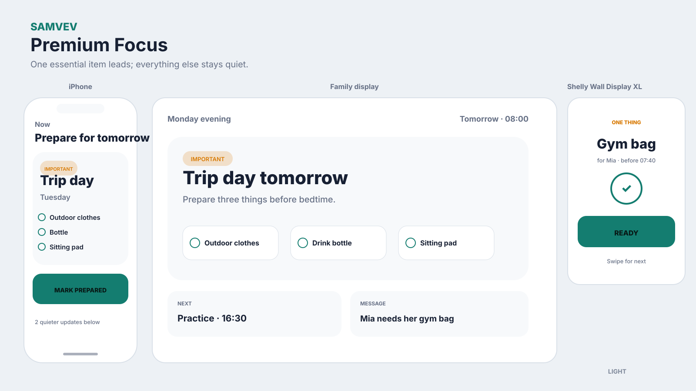
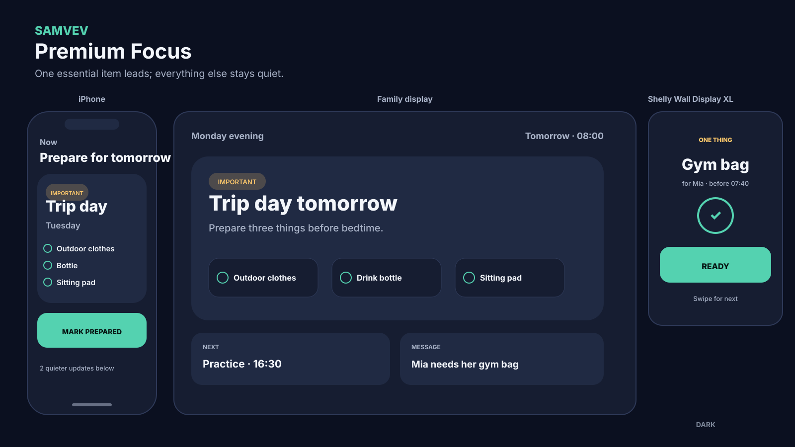

# Premium Focus

## Organizing idea

One important item dominates while a small number of supporting cards remain visible.

## Best suited for

A calm display that changes with morning, afternoon and evening context.

## Surface behavior

- **iPhone:** personal priority and actions first
- **Shared display:** household-safe group view readable at a distance
- **Shelly Wall Display XL:** one or a few location-relevant items with large controls

## Guardrail

Never rotate away an unacknowledged important notice without a persistent indicator.

## Light and dark mockups

The diagrams use fictional data and show layout logic rather than final visual polish.
